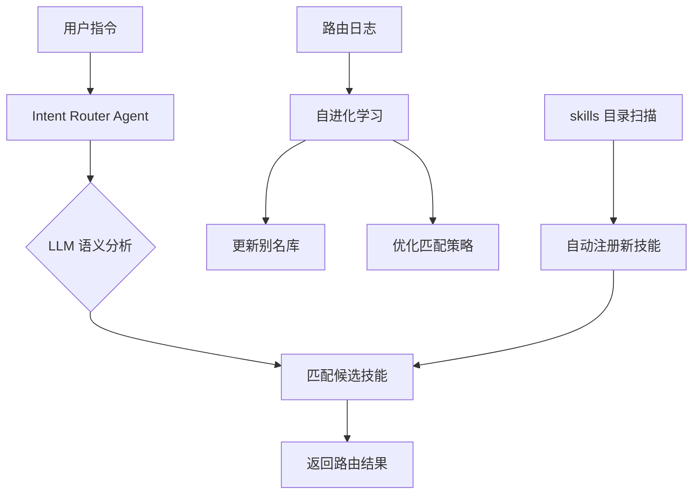

# Intent Router Agent — 自进化意图路由

## 架构设计



##  vs 传统意图识别

| 特性 | 传统关键词匹配 | Intent Router Agent |
|------|--------------|-------------------|
| 理解方式 | 关键词命中 | LLM 语义理解 |
| 灵活性 | 必须精确匹配 | 近似语义即可 |
| 新技能 | 手动添加别名 | 自动发现+注册 |
| 纠错 | 不改代码不行 | 说一句「不对」就学习 |
| 自升级 | ❌ | ✅ 自动优化策略 |

## 自进化机制

1. **日志驱动** — 每次路由写入 `routing-history.jsonl`
2. **纠错学习** — 当你说「不对，应该是 X」，Agent 记录并优化
3. **定期重扫** — 每次路由前检查 skills 目录，新技能自动加入路由表
4. **统计反馈** — 跟踪路由准确率，动态调整策略权重

## 命令

```bash
# 扫描技能
python3 skills/intent-router-agent/intent_router_agent.py scan

# 路由用户指令
python3 skills/intent-router-agent/intent_router_agent.py route "帮我分析这只股票"

# 纠正错误路由（自进化）
python3 skills/intent-router-agent/intent_router_agent.py correct "分析股票" "legal" "stock-study"

# 查看状态
python3 skills/intent-router-agent/intent_router_agent.py status
```

## 待改进

- [ ] LLM 集成：用 DeepSeek / Claude 替代关键词匹配做语义分析
- [ ] 多轮对话支持：通过上下文推断意图
- [ ] 主动反馈：当置信度偏低时，反问用户确认
